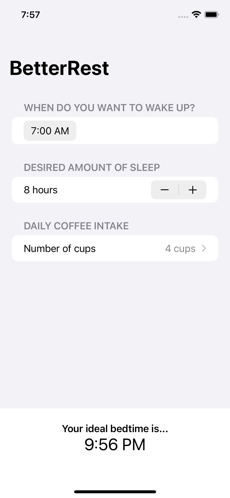

# Dose & Doze: Core ML Sleep Calculator ☕️💤

An iOS application that calculates optimal sleep cycles based on biological inputs and daily caffeine consumption. Built to demonstrate the integration of on-device machine learning with native declarative user interfaces.

    

## 🧠 Architecture & Tech Stack

This project was built entirely within the Apple ecosystem to prioritize zero-latency offline inference and strict type safety.

*   **Language:** Swift 5
*   **User Interface:** SwiftUI (Declarative UI, `@State` data binding)
*   **Machine Learning:** Core ML
*   **Environment:** Xcode

## ⚙️ The Machine Learning Pipeline

Unlike traditional apps that rely on cloud APIs to process data, this application performs all calculations natively on-device using **Core ML**.

1.  **The Model:** Utilizes a trained Tabular Regression model.
2.  **The Inputs:** The model accepts three primary parameters:
    *   Desired wake-up time.
    *   Target sleep duration (hours).
    *   Daily caffeine intake (cups of coffee).
3.  **The Inference:** The Swift `SleepCalculator` class formats the user's UI inputs, passes them through the `.mlmodel`, and outputs the exact recommended bedtime to maximize restorative sleep.

## ✨ Key Features

*   **Reactive State Management:** Utilizes SwiftUI's `@State` property wrappers so the recommended bedtime updates instantaneously as the user adjusts the sliders and pickers, without needing a "Calculate" button.
*   **Offline First:** The ML model is bundled directly within the app binary, ensuring 100% privacy and allowing the app to function without an internet connection.
*   **Dynamic Layout:** Built with SwiftUI Stacks and Forms to ensure the interface perfectly scales across all iPhone models and screen sizes.

## 🚀 How to Run Locally

To run this project on your own machine:

1. Clone this repository: `git clone https://github.com/YourUsername/YourRepoName.git`
2. Open the `BetterRest.xcodeproj` file in Xcode.
3. Wait for Xcode to finish indexing and compiling the Core ML model.
4. Select an iPhone simulator (e.g., iPhone 15 Pro) from the top menu.
5. Hit `Cmd + R` to build and run the application.
